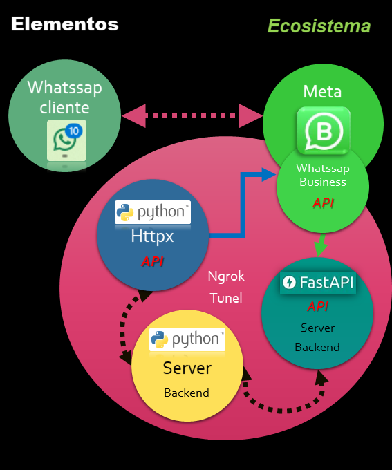

# Bot de Whatssap en python
WhatsApp bot in pure python

Este proyecto tiene el propósito de enviar y recibir mensajes a traves de whatssap entre un proveedor  y un cliente por whatssap.
   - La apliación esta para responder consultas con un saludo y presentarle un menú sobre temas a profundizar en base a la selección de una opción en un menú.
   - El objetivo de la aplicación y demás detalles del proyecto se explican a continuación.

## Ecosistema
Los componentes del ecosistema de la aplicación resultante de este proyecto son los siguientes:
1. ***Mensajería***: WhatssApp
2. ***Server***: 
    2.1. **Uvicorn**: Servidor de aplicaciones ASGI. Controla y gestiona las conexiones entrada y salida de la aplicación.
    2.2. **ngrok**: Herramienta que permite exponer un servidor local a internet.
3. ***APIs***:
    3.1. **Whatssap Business API**: API de whatssap para empresas que permite enviar y recibir mensajes a través de la plataforma de whatssap.
    3.2.**FastAPI**: Framework web de alto rendimiento para construir APIs con Python 3.6+ basado en estándares abiertos.
4. ***Backend***:
    4.1. **Python**: Lenguaje de programación interpretado cuya filosofía hace hincapié en la legibilidad de su código.
    4.2. **Pydantic**: Librería para la validación de datos en Python.
    4.3. **httpx**: Cliente HTTP para Python 3, que proporciona una interfaz de cliente HTTP similar a las bibliotecas estándar de Python.
5. ***Numeros de teléfono de whatssap***:
    5.1 **Proveedor**: Numero cedido para pruebas por meta de whatssap
    5.2 **Cliente**: Numero asignado por el desarrollador para prueba de la aplicación

## Arquitectura
La arquitectura de la aplicación se basa en el diagrama de componentes de la figura:


Y en consecuencia lo que hay que hacer es:
1. Configurar todo el ecosistema
2. Desarrollar e implementar la aplicación de los componentes dentro del circulo rojo.

##### Prerequisitos
Por tratarse de una app de automatización con Whatssap, por favor lea el documento:
  - [Automatzación con Whatssap](docs/Automatizacion-Whatssap.md).
  
- Resulta conveniente tener conocimientos básicos de:
  - APIs. Qué son, cómo funcionan y cómo interactuar con ellas.
  - Herramientas de desarrollo de Meta: Qué es. Documentación. Blogs. Foros. Ejemplos. Etc.
  - Python. Cómo instalar paquetes, cómo ejecutar un script, cómo crear un entorno virtual, etc.
  - HTTP. Qué es y cómo interactuar con él.
  - ASGI. De que se trata.
  - FastAPI. Qué es, cómo funciona y porqué fastAPI.
  - Pydantic. Qué es y cómo funciona.


### Configuración del ecosistema
#### Configuración de la API de WhatsApp Business
##### Requisistos
- Una cuenta de desarrollador de Meta: Si no tienes una, puedes crear una cuenta de desarrollador de Meta [aquí](https://developers.facebook.com/).
- Una app de negocios creada dentro del adminitrador de aplicaciones de meta. (business app). Si no tienes una, debes crear una app primero. Las intrucciones para esto se encuentran [aquí.](https://developers.facebook.com/docs/whatsapp/getting-started/create-business-app).
- Un número de teléfono de WhatsApp para empresas. Si no tienes uno, puedes solicitar uno [aquí.](https://developers.facebook.com/docs/whatsapp/getting-started/request-phone-number). Sin no quieres solicitarlo, meta te proporcionará uno para pruebas.
- Un número de teléfono de WhatsApp para pruebas. Si no tienes uno, puedes usar el tuyo propio. Pero este punto es mandatorio, necesitas uno o mas telefonos pra testear la aplicación como si fueran clientes/usuarios. Necesitas al menos un teléfono con WhatsApp para enviar y recibir mensajes, como lo haría un usuario/cliente normal.
##### Configurando la API de WhatsApp Business
Aquí, hay que configurar la API de WhatsApp Business. Para configurar la API de WhatsApp Business, sigue los pasos que se indican en la [documentación oficial](https://developers.facebook.com/docs/whatsapp/getting-started/).
Siguiendo los pasos de la documentación oficial, asegura de tener los siguientes puntos, cumplidos para disponeer de una versión gratuita de prueba de aplicaciones.
1. Crear una cuenta de desarrollador de Meta.
2. Crear una app de negocios en el administrador de aplicaciones de Meta.
3. Solicitar un número de teléfono de WhatsApp para empresas. Meta te provee uno si lo necesitas. Sino puedes usar un telefono de una empresa. 
   1. Lo importante es que aquí estamos hablando del telefono de la empresa que va a responder los mensajes, de los usuarios/clientes.
4. Configurar tu número de teléfono de WhatsApp para pruebas. Puedes usar tu propio número de teléfono si lo deseas. 
   1. Es posible habilitar hasta 5 numeros de telefonos para este propósito. 
   2. Es necesario al menos un número de teléfono para enviar y recibir mensajes, como lo haría un usuario/cliente normal.
5. Generar el token de sguridad de Meta. 
   1. Se trata de un token temporal en primera instancia. 
   2. Luego se puede generar un token de producción. 
      1. Para generar el token de producción, sigue los pasos que se indican en la [documentación oficial](https://developers.facebook.com/docs/whatsapp/getting-started/).
6. Configurar el webhook de la API de WhatsApp Business. 
   1. Para configurar el webhook de la API de WhatsApp Business, sigue los pasos que se indican en la [documentación oficial](https://developers.facebook.com/docs/whatsapp/getting-started/webhooks).
   2. Para activar el webhook es necesaria una url del servidor de la aplicación. 
      1. En este caso, se usará ngrok para exponer el servidor local a internet.
      2. ngrok proveera la url del servidor de la aplicación.
      3. Para configurar el webhook, se debe tener en cuenta que:
      6. La url del servidor de la aplicación debe ser una url segura (https).
      7. La url del servidor de la aplicación debe ser una url que responda a los requests de la API de WhatsApp Business en menos de 10 segundos.
      8. La url del servidor de la aplicación debe ser una url que responda a los requests de la API de WhatsApp Business con un código de estado 200.
   3. Para activar el webhook, también es preciso establecer un token de verificación.
      1. El token de verificación es un token que se envía en cada request de la API de WhatsApp Business. Se trata de un token que define el desarrollador y que se establece como una de las variables de entorno de la aplicación.
   
##### Configuración del gateway para el servidor local
###### Requisitos
 Si no tienes un servidor publico con dominio propio, puedes usar ngrok para exponer tu servidor local a internet. Para ello, sigue los siguientes pasos:
- Descarga ngrok desde la [página oficial](https://ngrok.com/).
- Descomprime el archivo descargado.
- Abre una terminal.
- Navega hasta la carpeta donde se encuentra el archivo descomprim
- Ejecuta el siguiente comando:
```bash
./ngrok http 8000
```
Este comando expone el servidor local en el puerto 5000 a internet. La salida del comando mostrará una url segura (https) que se puede usar para configurar el webhook de la API de WhatsApp Business.
También puedes utilizar una url personalizada **"persistente"** con ngrok. Para ello, sigue los siguientes pasos:
- Crea una cuenta en ngrok.
- Inicia sesión en ngrok.
- Ve a la sección de [tus túneles](https://dashboard.ngrok.com/endpoints/status).
- Haz clic en el botón "Create a new tunnel".
- Selecciona la región que prefieras.
- Selecciona el protocolo que prefieras.
- Selecciona el puerto que prefieras.
- Haz clic en el botón "Create".
- Copia la url segura (https) que se muestra en la sección de "Your new tunnel is ready".
- Utiliza esta url segura (https) para configurar el webhook de la API de WhatsApp Business.
- Para más información sobre cómo utilizar ngrok, consulta:
  - [documentación oficial](https://ngrok.com/docs).
  - cómo utilizar ngrok con FastAPI, consulta la [documentación oficial](https://fastapi.tiangolo.com/deployment/ngrok/).
  - cómo utilizar ngrok con Uvicorn, consulta la [documentación oficial](https://www.uvicorn.org/deployment/#using-ngrok).
  - cómo utilizar ngrok con ASGI, consulta la [documentación oficial](https://asgi.readthedocs.io/en/latest/).

##### Configuración del cliente HTTP para Python 3
###### Requisitos
- Un cliente HTTP para Python 3. En este caso se usará httpx.
- Un entorno virtual de Python. En este caso se usará venv.
- Un editor de código. En este caso se usará Visual Studio Code.
- Un sistema operativo compatible con Python 3. En este caso se usará Windows 10.
- Un terminal de comandos. En este caso se usará PowerShell.
- Un gestor de paquetes de Python. En este caso se usará pip.
- Un gestor de entornos virtuales de Python. En este caso se usará venv.


#### Configuración de servidor de la aplicación.
##### Requisitos
- Un servidor para alojar la aplicación. Puede ser un servidor local o un servidor en la nube. En este caso se usará un servidor local.
- Un servidor local de aplicaciones ASGI. En este caso se usará Uvicorn.
- Un túnel para exponer el servidor local a internet. En este caso se usará ngrok.
- Un cliente HTTP para Python 3. En este caso se usará httpx.
- Un framework web de alto rendimiento para construir APIs con Python 3.6+. En este caso se usará FastAPI.
  - Una librería para la validación de datos en Python. En este caso se usará Pydantic.
- Un entorno virtual de Python. En este caso se usará venv.
  - Un editor de código. En este caso se usará Visual Studio Code.
  
## Guía rápida de configuración
En internet he preparado un video (tutorial) que muestra cómo configurar el ecosistema de la aplicación. Puedes ver el video [aquí](https://www.youtube.com/watch?v=8QJj8J1J1Z4).

### Entorno
El entorno se configura en un archivo `.env` 
Como es usual el archivo de entorno no se comparte porque:
- Es sensible a cuestiones de seguridad.
- Depende del entorno de desarrollo de quién instale y utilice este código.

Una vez que instale el código construya su entorno en un archivo y nombrelo `.env` en el directorio raiz de app.
- Este archivo de entorno debe quedar configurado y guardado en el mismo directorio que `main.py`.
- Para configurar este archivos las instrucciones estan el archivo [README_env.md](./docs/README_env.md) en la carpeta docs.

#### Entendiendo la Seguridad de Webhooks

A continuación, se resume de la documentación de la API de Webhooks de Meta sobre verificación y seguridad
[El detalle se puede contultar el la sección de documentos de Meta](https://developers.facebook.com/docs/graph-api/webhooks/getting-started)

##### Solicitudes de Verificación

Cada vez que se configura el producto Webhooks en el Panel de control de tu aplicación, se enviaremos una solicitud GET a la URL de tu endpoint. 
Las solicitudes de verificación incluyen los siguientes parámetros de cadena de consulta, agregados al final de la URL de tu endpoint. Se verán así:

```
https://your-webhook-url.com/webhook?hub.verify_token=your_verify_token&hub.challenge=your_challenge
```
también puede expresarse así:
```
GET https://www.your-clever-domain-name.com/webhook?
hub.mode=subscribe&
hub.challenge=1158201444&
hub.verify_token=meatyhamhock
```
es decir, la información contenida es la siguiente:
- `hub.verify_token`: El token de verificación que proporcionaste al configurar tu producto Webhooks.
- `hub.challenge`: Un token aleatorio que tu aplicación debe responder con para completar el proceso de verificación.
- `hub.mode`: El valor de este parámetro es siempre `subscribe`.
- `hub.topic`: El valor de este parámetro es siempre `webhook`.
- `hub.lease_seconds`: El valor de este parámetro es siempre `604800` (una semana).
- `hub.callback_url`: La URL de tu endpoint.
- `hub.secret`: El secreto de tu aplicación.

##### Payload
Para ver la estructura del payload se resume en [un archivo de este proyecto](docs/WA_Payload_Notification.md) 
WhatsApp firma todas las cargas útiles de las notificaciones de eventos con una firma SHA256 e incluye la firma en el encabezado X-Hub-Signature-256 de la solicitud, precedida por sha256=. No es necesario que valides la carga útil, pero deberías hacerlo.

Para validar la carga útil:
Genera una firma SHA256 usando la carga útil y el secreto de aplicación de tu aplicación.
Compara tu firma con la firma en el encabezado X-Hub-Signature-256 (todo lo que esté después de sha256=). Si las firmas coinciden, la carga útil es genuina.


## Aplicación
### Objetivo
Esta aplicación es un ejercicio de intereacción con un usuario de Whatsapp.
La aplicación espera a que un usuario envia un mensaje. Cuando esto sucede, responde con:
1. Un saludo: "Hola!".
2. Inmediatamente le devuelve un mensaje: "Por favor elije una opción:" y un menú con tres opciones: "Pileta", Tenis", "SUM".
Cada vez que el usuario elije una opción, el server informa por log la opción seleccionada.

#### Escenario
Se trata de un escenario hipotetico de un numero de Whatsapp asignado por un barrio cerrado para responder consulta sobre el reglamento y los procediminentos de uso de las instalacióndes de un club o un barrio cerrado. (Pileta, canchas de tenis y salún de usos múltiples)

### Presentación
Si se instala desde el repositorio de github, se configuran los parámetros correspondientes, la aplicación funciona perfectamente y cumple con el objetivo planteado.

#### Estructura y organización
La estructura del proyecto se describe a continuación.
* [app/](.\WA_FA_chatbot\app)
  * [config_setup/](.\WA_FA_chatbot\app\config_setup)
  * [routes/](.\WA_FA_chatbot\app\routes)
  * [schemas/](.\WA_FA_chatbot\app\schemas)
  * [services/](.\WA_FA_chatbot\app\services)
  * [utils/](.\WA_FA_chatbot\app\utils)
  * [__init__.py](.\WA_FA_chatbot\app\__init__.py)
* [docs/](.\WA_FA_chatbot\docs)
  * [images/](.\WA_FA_chatbot\docs\images)
  * [Automatizacion-Whatssap.md](.\WA_FA_chatbot\docs\Automatizacion-Whatssap.md)
  * [Markdown short guide.md](.\WA_FA_chatbot\docs\Markdown short guide.md)
  * [README_env.md](.\WA_FA_chatbot\docs\README_env.md)
  * [README_Estructura.md](.\WA_FA_chatbot\docs\README_Estructura.md)
  * [README_main.md](.\WA_FA_chatbot\docs\README_main.md)
  * [README_settings.md](.\WA_FA_chatbot\docs\README_settings.md)
  * [README_wa_services.md](.\WA_FA_chatbot\docs\README_wa_services.md)
  * [README_webhook.md](.\WA_FA_chatbot\docs\README_webhook.md)
  * [WA_Payload_Notification.md](.\WA_FA_chatbot\docs\WA_Payload_Notification.md)
* [tests/](.\WA_FA_chatbot\tests)
  * [start/](.\WA_FA_chatbot\tests\start)
  * [version_backup/](.\WA_FA_chatbot\tests\version_backup)
* [.env](.\WA_FA_chatbot\.env)
* [.gitignore](.\WA_FA_chatbot\.gitignore)
* [main.py](.\WA_FA_chatbot\main.py)
* [README.md](.\WA_FA_chatbot\README.md)
* [requirements.txt](.\WA_FA_chatbot\requirements.txt)
* [__init__.py](.\WA_FA_chatbot\__init__.py)

Y eta organización se explica en:
* [README_Estructura.md](.\WA_FA_chatbot\docs\README_Estructura.md)

#### Configuración de la app
Por favor configurar el archivo de entorno ".env" en el directorio raíz del proyecto con las variables que la aplicación necesita.
Las variables que la aplicación necesita están explicasdas en el archivo: [README_env.md](.\WA_FA_chatbot\docs\README_env.md)

##### Utilización de la api de Meta
Se recomienda, utilizar documentación de Meta para aprender [como desarrollar una app y comenzar a enviar y recibir mensajes.](https://developers.facebook.com/docs/whatsapp/cloud-api).

### Módulos de la app a destacar
El archivo `main.py` es el punto de entrada de la aplicación FastAPI para el chatbot de WhatsApp. 
- Configura el logger, carga la configuración, registra las rutas y maneja excepciones. 
- Además, inicia un túnel ngrok para exponer el servidor local a internet y ejecuta el servidor Uvicorn. 
- Si hay errores críticos en el arranque, se registran y detienen la aplicación para garantizar estabilidad.
Una descripción más detallada puede encontrarse en el [readme correspondiente](.\WA_FA_chatbot\docs\README_main.md).

El archivo `webhook_routes.py` es el que maneja las rutas del server y por lo tanto supervisa la comunicación entre usuarios con la empresa a traves de meta.
- Posee una estructura muy simple.
- Deriva la logica del tratamiento de los POST que recibe de Meta a oto módulo para mantener la limipieza y el órden en la codificación.
Una descripción más detallada puede encontrarse en el [readme correspondiente](.\WA_FA_chatbot\docs\README_webhook_routes.md).


Para todoslos módulos la documentación está contenida en el directorio docs.
- Cada módulo tiene un README corrrespondiente.
- El archivo README_Estructura.md puede verse el listado de los READMEs de documentación.


